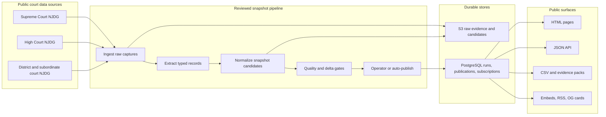
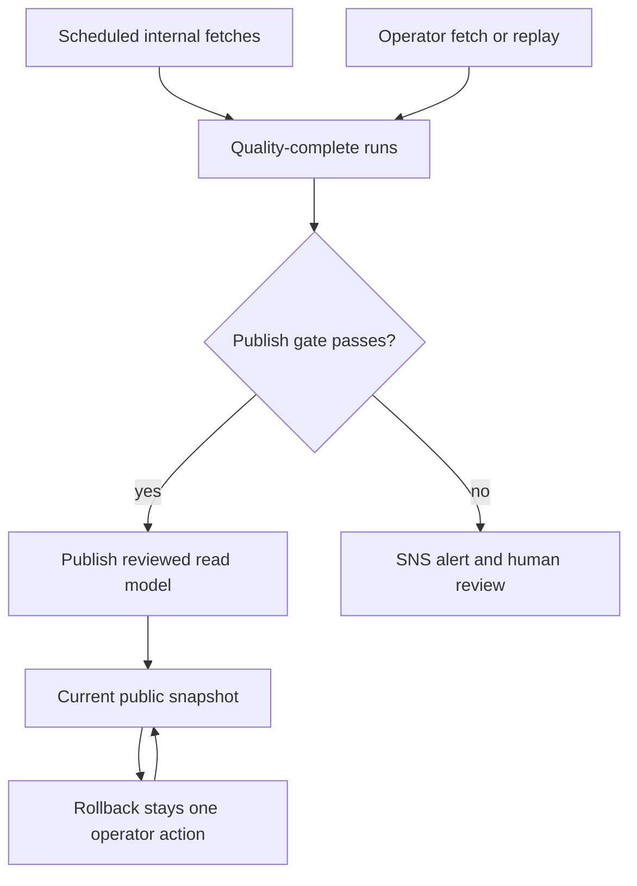

# NyaayWatch

<p align="center">
  
</p>

<p align="center">
  <strong>How long is India waiting for justice?</strong>
</p>

<p align="center">
  <a href="https://nyaaywatch.in">Live site</a> ·
  <a href="https://nyaaywatch.in/learn">Learn</a> ·
  <a href="https://nyaaywatch.in/press">Press & embed kit</a> ·
  <a href="https://nyaaywatch.in/methodology">Methodology</a> ·
  <a href="https://nyaaywatch.in/api">API reference</a> ·
  <a href="https://nyaaywatch.in/data">Data downloads</a> ·
  <a href="https://www.linkedin.com/company/132634238/">LinkedIn</a>
</p>

<p align="center">
  
  
  
</p>

NyaayWatch publishes reviewed, versioned snapshots of pending caseloads, clearance rates, and wait times across India's Supreme Court, all 25 High Courts, and the lower courts in every state and Union Territory. It is drawn from public NJDG data with methodology disclosure, source attribution, and reproducible evidence boundaries.

Open-source project links: [Contributing](CONTRIBUTING.md) · [Code of conduct](CODE_OF_CONDUCT.md) · [Security policy](SECURITY.md) · [License](LICENSE) · [LinkedIn](https://www.linkedin.com/company/132634238/)

```bash
curl https://nyaaywatch.in/v1/stats/himachal | jq
curl https://nyaaywatch.in/v1/districts | jq '.districts[0]'
```

## What Is Live

| Court layer | Public surface | Coverage |
| --- | --- | --- |
| Supreme Court | `/supreme-court`, `/v1/supreme-court/...` | Public beta aggregate snapshot |
| High Courts | `/high-courts`, `/high-courts/:slug`, `/v1/high-courts/:slug/...` | All 25 HC NJDG selector-backed High Court profiles |
| Lower courts | `/states/:slug`, `/v1/states/:slug/...` | All 36 state/Union Territory NJDG selector geographies |
| Default lower-court shortcuts | `/districts`, `/data`, `/methodology`, `/api` | Himachal Pradesh compatibility surface |
| Public education | `/learn` | Court-system and pressure-signal guide |

Each court family ships paired overview, `/data`, `/methodology`, and `/api` pages plus a stable `/v1/...` JSON contract where applicable.

## Public Surfaces

| Surface | Routes | Purpose |
| --- | --- | --- |
| Investigation flows | `/movers`, `/states/:slug/movers`, `/compare/:slug`, `/states/:slug/compare/:slug`, `/watch`, `/watch/old-case-burden`, `/watch/persistent-pressure`, `/watch/backlog-concentration` | Find movement, pressure, issue watchrooms, and district-to-district comparisons without cross-tier rankings |
| District detail | `/districts/:id`, `/states/:slug/districts/:id` | Durable local pages with history, citation text, and exports |
| Evidence packs | `/data/evidence/...`, `/states/:slug/data/evidence/...` | Safe public JSON bundles for lower-court state and district metrics |
| Embeds | `/embed/district/:id`, `/embed/state/:slug` | Frameable district and state widgets |
| Press assets | `/press`, `/press/logo-light.svg`, `/press/logo-dark.svg` | Brand assets, citations, and public communication material |
| Social cards | `/og/home.png`, `/og/national.png`, `/og/state/:slug.png`, `/og/district/:id.png`, `/og/high-court/:slug.png`, `/og/supreme-court.png` | Generated Open Graph cards for sharing |
| Subscriptions | `/subscribe`, `/subscribe/confirm/:token`, `/unsubscribe/:token` | Plain-text email updates for new lower-court snapshots when newsletter email is configured |
| Feeds and discovery | `/states/:slug/feed.xml`, `/sitemap.xml`, `/robots.txt` | RSS, crawler discovery, and operator-route exclusion |

## Product Guardrails

- Snapshot-based, not live.
- Every public metric has reproducible provenance from stored evidence.
- No predictive, AI-forward, or legal-analysis claims.
- Anomalies are flagged signals, not verdicts.
- Raw upstream artifacts are never exposed publicly.

## Architecture





- One AWS-hosted containerized app, fronted by Cloudflare.
- PostgreSQL is the canonical store for runs, artifacts, subscriptions, and publication state.
- S3 stores raw scrape evidence, normalized snapshot candidates, release evidence, and outreach archives.
- Publish requires an operator action or a passing auto-publish gate.
- Auto-publish validates fresh internal runs against quality and delta guardrails, publishes when safe, and pages via SNS when blocked. Lower-court sweeps also block concentrated single-district pending swings and large absolute pending moves that stay under the primary 20% fraction threshold.
- A daily publish-pending sweep walks quality-complete runs per scope from the past 3 days and runs each through the same gate.
- Published snapshot read models drive every public surface; rollback is one operator call.

## Repository Map

| Path | Responsibility |
| --- | --- |
| `src/api/` | Express app, public routes, operator routes, HTML rendering, RSS, embeds, and OG card registration |
| `src/api/design/`, `src/api/home/`, `src/api/pages/`, `src/api/share/` | Shared page shell, national homepage models, route renderers, and generated share images |
| `src/domain/` | Zod schemas and typed contracts for captured, candidate, and published snapshots |
| `src/ingest/`, `src/extract/`, `src/normalize/` | Pipeline stages from upstream NJDG capture to deterministic snapshot candidates |
| `src/services/` | Published snapshot orchestration, newsletter delivery, and cache invalidation |
| `src/storage/` | PostgreSQL and S3 adapters |
| `src/db/` | SQL migrations and migration tooling |
| `src/dev/` | Operator CLIs, release helpers, schedule entrypoints, readiness checks, and local bootstrap scripts |
| `src/ops/` | Auto-publish gate, publish-pending runner, and alarm notification |
| `src/config/`, `src/lib/`, `src/preview/` | Environment parsing, shared utilities, and preview runtime helpers |
| `infra/aws/` | AWS dev, preview, staging, production, schedule, and cutover scripts/templates |
| `.github/workflows/` | CI, deploy, preview cleanup/reconcile, watchdog, outreach, and publish-pending workflows |
| `fixtures/`, `tests/` | Captured NJDG fixtures and regression coverage |
| `brand/`, `assets/` | Brand system, logo assets, and bundled fonts |
| `docs/` | Design, methodology, release, operations, source reviews, and coverage audit docs |

## Quickstart

Prerequisites: Node `>=22`, Docker with Compose, npm.

```bash
cp .env.example .env
npm install
npm run docker:up
npm run dev:bootstrap
npm run dev
```

Defaults to `http://127.0.0.1:3000`. Local development uses PostgreSQL plus LocalStack S3; keep `AWS_REGION=ap-south-1` so the code path matches production. If `5432` or `4566` are already in use, override `POSTGRES_PORT` and `LOCALSTACK_PORT` in `.env` and keep `DATABASE_URL` and `AWS_ENDPOINT_URL_S3` aligned.

## Operator Workflow

```bash
npm run operator:fetch -- "Manual Himachal fetch"
npm run operator:inspect -- <run-id>
npm run operator:publish -- <run-id> "Publish completed snapshot"
npm run operator:replay -- <run-id>
npm run operator:rollback -- <publication-id>
```

For live remote operation against `https://nyaaywatch.in`:

```bash
npm run operator:remote -- --base-url=https://nyaaywatch.in publications
npm run operator:remote -- --base-url=https://nyaaywatch.in --state=UP fetch "Internal Uttar Pradesh fetch"
npm run operator:remote -- --base-url=https://nyaaywatch.in --high-court=gujarat fetch "Internal Gujarat HC fetch"
npm run operator:remote -- --base-url=https://nyaaywatch.in --supreme-court fetch "Internal SC fetch"
npm run operator:production -- --state=UP fetch "Internal Uttar Pradesh fetch"
npm run infra:production-preflight
npm run infra:production-cutover-inventory
npm run ops:njdg-missing-zero-outreach -- --base-url=https://nyaaywatch.in
```

Use `npm run operator:production` for production heavy-state lanes that should run inside a one-off ECS task instead of through the Cloudflare-fronted operator path. It targets the reality-named production backing stack `nyaaywatch-production`. Dedicated AWS staging is provisioned on demand and was retired on `2026-07-09` for alpha cost; recreate `nyaaywatch-staging` only for a real rehearsal. After the production public-ingress WAF is enabled, direct ALB `--connect-host=<alb-dns>` operator traffic is blocked unless the WAF is intentionally disabled or allowlisted for a controlled recovery window. Production ECS defaults to one task; set `PRODUCTION_DESIRED_COUNT=2` for an HA window.

Use `npm run infra:production-preflight` before any production-stack cutover work. It performs read-only checks against the current production backing stack and `https://nyaaywatch.in`; it does not deploy, update DNS, rename resources, or change the live service.

Use `npm run infra:production-cutover-inventory` before any mutating production-stack cutover work. It records the current stack outputs, ECS image, runtime bucket/secret bindings, database instance identifier, schedule targets, and target-stack status needed by the production cutover runbook. The April 28, 2026 cutover restored `nyaaywatch-production` from manual RDS snapshot `nyaaywatch-prod-cutover-20260428-0019`, synced the artifacts bucket, moved DNS to the production ALB, and reconciled production-named schedules. The later staging reclaim pointed `staging.nyaaywatch.in` at the `nyaaywatch-staging` ALB with the staging ACM certificate; `nyaaywatch-staging-v2` was retired after the reclaim.

Use `npm run ops:njdg-missing-zero-outreach -- --base-url=https://nyaaywatch.in` to scan public lower-court snapshots for rows where NJDG reports pending cases but `0` filed and `0` cleared cases for last month. The command routes unresolved rows to the official NJDG CPC contact for each affected state or Union Territory. Add `--send` only when `SES_SOURCE_EMAIL` is an authenticated `@nyaaywatch.in` sender and `NJDG_OUTREACH_ARCHIVE_BUCKET` is configured; the send path BCCs the verified sender, sets `Reply-To` from `NJDG_OUTREACH_REPLY_TO` when configured, writes the exact outbound payload to S3 under `ops/njdg-missing-zero-outreach/`, and fails loudly if email or archive configuration is incomplete.

Release helpers:

```bash
npm run release:prepublish -- --run-id=<run-id> --base-url=https://nyaaywatch.in
npm run release:postpublish -- --publication-id=<publication-id> --base-url=https://nyaaywatch.in
npm run release:record -- --publication-id=<publication-id> --base-url=https://nyaaywatch.in --reviewer="<name>"
npm run release:purge-public-routes -- --high-court=<court-slug>
```

Each release helper accepts `--state-slug=<slug>` or `--high-court=<slug>` to scope to the right court family. `release:verify` also accepts `--supreme-court` for the apex-tier public surface.

## Scheduled Internal Fetches

The live deploy runs five ECS schedules, all reconciled to the latest task definition with `npm run operator:reconcile-fetch-schedule`:

| Schedule | Cadence |
| --- | --- |
| Lower-court state and UT profiles | `8:00 AM Asia/Kolkata` |
| Supreme Court | `8:10 AM Asia/Kolkata` |
| Reviewed High Courts | `8:20 AM Asia/Kolkata` |
| Publish-pending sweep | `8:30 AM Asia/Kolkata` |
| Public-alpha ops smoke monitor | Hourly against representative public surfaces on `https://nyaaywatch.in` |

The GitHub Actions `ops:njdg-missing-zero-outreach` schedule runs every Monday, Wednesday, and Friday at `04:30 UTC` / `10:00 AM Asia/Kolkata` from the SES-verified `data@nyaaywatch.in` sender with domain-aligned SPF/DKIM/DMARC. It emails official CPC contacts for affected NJDG state or Union Territory rows only while public lower-court snapshots still contain source rows with pending cases but `0` filed and `0` cleared monthly movement. Each send BCCs the verified sender and archives the subject, body, recipients, reply-to recipients, SES message ID, and affected rows in the production artifacts bucket.

If the outreach send fails, the workflow opens or updates the durable `NJDG outreach failure` GitHub issue and publishes to the production SNS alert topic. A later successful run closes the issue and sends a recovery notification.

The lower-court schedule covers everything in `listInternalFetchStateProfiles()`. The High Court schedule auto-includes any court whose `sourceReviewStatus` is `reviewed`. The in-stack ops monitor runs a low-blast-radius smoke target set by default and pages on route/parity drift, stale public snapshots, or internal fetch lag in those representative surfaces. The daily GitHub watchdog and manual `npm run ops:verify-public-alpha -- --base-url=https://nyaaywatch.in` command still run the full all-public-target sweep unless `--target-set=smoke` is passed explicitly. Auto-publish publishes directly when quality and delta checks pass; it pages via SNS when the gate blocks for human review or when the publish step itself fails.

## Public API

State-scoped, court-scoped, and cross-jurisdiction endpoints follow the same published-snapshot shape.

```http
GET /v1/stats/himachal
GET /v1/districts
GET /v1/trends
GET /v1/states/:stateSlug/{stats,districts,trends}
GET /v1/high-courts/:courtSlug/{stats,trends}
GET /v1/supreme-court/{stats,trends}
GET /data/evidence/state.json
GET /data/evidence/districts/:districtId.json
GET /states/:stateSlug/data/evidence/state.json
GET /states/:stateSlug/data/evidence/districts/:districtId.json
```

Full contract coverage lives in the API and route tests under `tests/`. Lower-court snapshot metadata separates provenance from display freshness:

- `sourceSnapshotAt` is the upstream NJDG source date when the stored evidence exposes a defensible one, otherwise `null`.
- `referenceDateAt` is the date used for public freshness, trends, and CSV `snapshot_date`.
- `referenceDateKind` is either `source_snapshot_at` or `captured_at`.
- State-level pressure metrics that depend on optional NJDG inputs use tagged values: `{ "state": "ok", "value": ... }` when computable, or `{ "state": "missing", "reason": "source-not-published" | "insufficient-history" | "incomplete-breakdown" | "not-applicable" }`.

## Operator API

All `/operator/*` routes require `x-operator-token`.

| Namespace | Scope |
| --- | --- |
| `/operator/runs`, `/operator/publications` | Lower-court runs and publications, state-scoped via `stateCode` or `stateSlug` |
| `/operator/high-courts/:courtSlug/...` | High Court runs and publications |
| `/operator/supreme-court/...` | Supreme Court runs and publications |

Each namespace exposes `runs`, `runs/:runId`, `runs/fetch`, `runs/:runId/{publish,replay}`, `publications`, and `publications/:publicationId/rollback`.

## Testing

```bash
npm run typecheck
npm test
npm run test:e2e
RUN_PERSISTENT_STACK_TESTS=1 npm run test:persistent
```

If Playwright browsers are not installed: `npx playwright install`.

Coverage spans migration safety, golden-fixture capture, publish gating, replay/rollback, district history and CSV export parity, browser E2E for citizen/reporter/developer flows, responsive and accessibility checks, stable API contracts, persistent-stack replay/rollback through local PostgreSQL plus LocalStack S3, operator token enforcement, copy guardrails, newsletter flows, RSS, preview cleanup, Cloudflare purge behavior, and public-alpha operations.

## Screenshot Assets

```bash
npm run screenshots:linkedin
```

This captures the current public site into `~/Desktop/nyaaywatch-linkedin` for LinkedIn launch assets.

## Key Docs

Design and product:

- [Design system](DESIGN.md)
- [Brand system](brand/BRAND.md)
- [Copy voice](docs/COPY_VOICE.md)
- [National product architecture](docs/NATIONAL_PRODUCT_ARCHITECTURE.md)
- [Long-term data strategy](docs/LONG_TERM_DATA_STRATEGY.md)
- [Metric strategy](docs/METRIC_STRATEGY.md)

Operations and release:

- [Development workflow](docs/DEVELOPMENT_WORKFLOW.md)
- [Storage and operator flow](docs/STORAGE_AND_OPERATIONS.md)
- [Release policy](docs/RELEASE_POLICY.md)
- [On-call policy](docs/ON_CALL_POLICY.md)
- [High Court freshness runbook](docs/HIGH_COURT_FRESHNESS_RUNBOOK.md)
- [Operating evidence](docs/OPERATING_EVIDENCE.md)
- [Public data exposure policy](docs/PUBLIC_DATA_EXPOSURE_POLICY.md)
- [Public alpha launch comms](docs/PUBLIC_ALPHA_LAUNCH_COMMS.md)
- [Domain cutover checklist](docs/DOMAIN_CUTOVER_CHECKLIST.md)
- [Production cutover runbook](docs/PRODUCTION_CUTOVER_RUNBOOK.md)
- [Deployment status and environment map](docs/internal/DEPLOYMENT_STATUS.md)
- [Release history](docs/internal/RELEASE_HISTORY.md)

Per-state and per-court readiness reviews, source reviews, methodology drafts, and go-live checklists live alongside these in `docs/`. Start from [INDIA_COURT_COVERAGE_AUDIT.md](docs/INDIA_COURT_COVERAGE_AUDIT.md) for the full jurisdiction map, or [TODOS.md](TODOS.md) for the working backlog.

## Non-Goals

Case-level search, PDF parsing, judge rankings, predictive forecasting, AI legal analysis, real-time claims.

## Voice

Investigative, public-interest, calm, exact, evidence-first.
