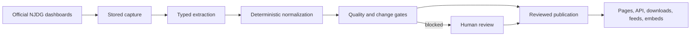
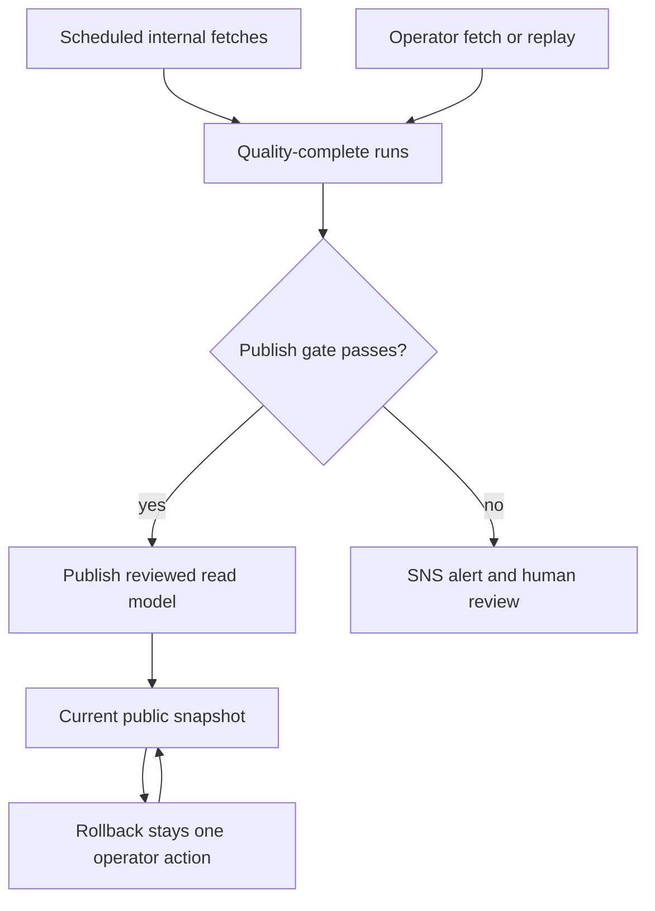

# NyaayWatch

<p align="center">
  
</p>

<p align="center">
  <strong>Public court data for India, with the evidence attached.</strong>
</p>

<p align="center">
  <a href="https://nyaaywatch.in">Open NyaayWatch</a> ·
  <a href="https://nyaaywatch.in/learn">Learn how it works</a> ·
  <a href="https://nyaaywatch.in/#accountability">Read the methodology</a> ·
  <a href="https://nyaaywatch.in/api">Use the API</a> ·
  <a href="CONTRIBUTING.md">Contribute</a>
</p>

<p align="center">
  
  
  
  
</p>

NyaayWatch turns public National Judicial Data Grid (NJDG) data into reviewed, versioned snapshots of pending cases, filings, clearances, case age, and court-level pressure signals. It covers the Supreme Court, all 25 High Courts, and all 36 lower-court state and Union Territory selector geographies.

The project is built for people who need to inspect, explain, or cite court data: citizens, reporters, researchers, civic groups, and developers. Every number on the public site is tied to stored evidence and an explicit methodology boundary.

## Start here

| If you want to... | Start with... |
| --- | --- |
| Explore the public data | [Open the live site](https://nyaaywatch.in) |
| Understand the numbers | [Methodology](https://nyaaywatch.in/#accountability) and [Learn](https://nyaaywatch.in/learn) |
| Build on the data | [API reference](https://nyaaywatch.in/api) and [choose a lower-court geography](https://nyaaywatch.in/#lower-court-pages) |
| Cite or share a result | [Choose an evidence page](https://nyaaywatch.in/#lower-court-pages) and the [press and embed kit](https://nyaaywatch.in/press) |
| Run the project locally | [Quickstart](#quickstart) |
| Improve the project | [Contributing guide](CONTRIBUTING.md) |

## What you can do

- Browse the Supreme Court, High Courts, states, Union Territories, and districts.
- See how pending cases, filings, and clearances changed between published snapshots.
- Compare districts within the same lower-court geography instead of collapsing unlike court tiers into one ranking.
- Inspect flagged pressure signals and the reasons behind them.
- Download evidence packs, use the JSON API, subscribe to snapshot updates, or embed a district or state view.

NyaayWatch is a public alpha publishing reviewed snapshots. Coverage means that a court or geography has a configured public snapshot surface. It does not mean case-level search, a live feed, or a claim that every court tier can be compared directly.

## Current coverage

| Court layer | Public surface | Coverage |
| --- | --- | --- |
| Supreme Court | [`/supreme-court`](https://nyaaywatch.in/supreme-court) and `/v1/supreme-court/...` | Aggregate public snapshot |
| High Courts | [`/high-courts`](https://nyaaywatch.in/high-courts) and `/v1/high-courts/:slug/...` | All 25 High Court NJDG selectors |
| Lower courts | [`/states/:slug`](https://nyaaywatch.in/states/punjab) and `/v1/states/:slug/...` | All 36 state and Union Territory NJDG selectors |

The home page is the national entry point, followed by explicit state, Union Territory, High Court, and Supreme Court routes.

Legacy compatibility note: `/districts`, `/data`, and `/methodology` are unscoped Himachal Pradesh lower-court shortcuts. Use the homepage geography selector and `/states/:stateSlug/...` routes for a specific geography. `/api` is the national API reference; state-specific API pages use `/states/:stateSlug/api`.

## The trust model

NyaayWatch treats the publication boundary as part of the product.

1. Capture public NJDG pages and responses as raw evidence.
2. Extract typed records and normalize them into snapshot candidates.
3. Run schema, quality, and change checks.
4. Publish only a reviewed snapshot read model.
5. Serve the same published model to the website, API, downloads, feeds, and embeds.



The rules are deliberately plain:

- Data is snapshot-based, not live.
- Every public metric has reproducible provenance from stored evidence.
- `sourceSnapshotAt` is used when the upstream evidence exposes a defensible source date; otherwise the public contract labels the capture date used for freshness.
- Anomalies are signals to inspect, not verdicts about a court or judge.
- The project makes no predictive, AI-forward, or legal-analysis claims.
- Raw upstream artifacts are kept out of the public API and downloads.

## Use the API

The public API serves the same published snapshot that powers the site.

```bash
STATE_SLUG=your-state-slug
COURT_SLUG=your-court-slug
curl "https://nyaaywatch.in/v1/states/$STATE_SLUG/stats" | jq
curl "https://nyaaywatch.in/v1/states/$STATE_SLUG/districts" | jq '.districts[0]'
curl "https://nyaaywatch.in/v1/states/$STATE_SLUG/trends" | jq
curl "https://nyaaywatch.in/v1/high-courts/$COURT_SLUG/trends" | jq
curl https://nyaaywatch.in/v1/supreme-court/stats | jq
```

Useful public routes include:

```text
GET /v1/states/:stateSlug/{stats,districts,trends}
GET /v1/high-courts/:courtSlug/{stats,trends}
GET /v1/supreme-court/{stats,trends}
GET /states/:stateSlug/data/evidence/state.json
GET /states/:stateSlug/data/evidence/districts/:districtId.json
```



- One AWS-hosted containerized app, fronted by Cloudflare.
- PostgreSQL is the canonical store for runs, artifacts, subscriptions, and publication state.
- S3 stores raw scrape evidence, normalized snapshot candidates, release evidence, and outreach archives.
- Publish requires an operator action or a passing auto-publish gate. The change gate compares each complete run with an agreed median of its recent prior trend points, so one bad historical publication does not poison later comparisons while a sustained jump or conflicted short history still goes to review.
- Auto-publish validates fresh internal runs against quality and delta guardrails, publishes when safe, and pages via SNS when blocked.
- A daily publish-pending sweep walks quality-complete runs per scope from the past 3 days and runs each through the same gate. It sends one review digest per scope with held run IDs and gate values, excluding runs superseded by a later successful publication. Unresolved runs in that window appear in each daily reminder; publish failures still alert immediately.
- Published snapshot read models drive every public surface; rollback is one operator call.
- The production target supports AWS/S3 and Azure Blob storage behind the same artifact-store interface; the Azure deployment lives under `infra/azure/production/`.

## Repository Map

| Path | Responsibility |
| --- | --- |
| `src/api/` | Express app, public routes, operator routes, HTML rendering, RSS, embeds, and OG card registration |
| `src/api/design/`, `src/api/home/`, `src/api/pages/`, `src/api/share/` | Shared page shell, national homepage models, route renderers, and generated share images |
| `src/domain/` | Zod schemas and typed contracts for captured, candidate, and published snapshots |
| `src/ingest/`, `src/extract/`, `src/normalize/` | Pipeline stages from upstream NJDG capture to deterministic snapshot candidates |
| `src/services/` | Published snapshot orchestration, newsletter delivery, and cache invalidation |
| `src/storage/` | PostgreSQL plus AWS S3 and Azure Blob adapters |
| `src/db/` | SQL migrations and migration tooling |
| `src/dev/` | Operator CLIs, release helpers, schedule entrypoints, readiness checks, and local bootstrap scripts |
| `src/ops/` | Auto-publish gate, publish-pending runner, and alarm notification |
| `src/config/`, `src/lib/`, `src/preview/` | Environment parsing, shared utilities, and preview runtime helpers |
| `infra/aws/` | AWS dev, preview, staging, production, schedule, and cutover scripts/templates |
| `infra/azure/` | Azure production migration target, Terraform, transfer scripts, and cutover runbook |
| `.github/workflows/` | CI, deploy, preview cleanup/reconcile, watchdog, outreach, and publish-pending workflows |
| `fixtures/`, `tests/` | Captured NJDG fixtures and regression coverage |
| `brand/`, `assets/` | Brand system, logo assets, and bundled fonts |
| `docs/` | Design, methodology, release, operations, source reviews, and coverage audit docs |

See the [API reference](https://nyaaywatch.in/api) for the current contract and the homepage's lower-court selector for downloadable evidence by geography.

## Quickstart

You need Node `>=22`, npm, and Docker with Compose.

```bash
git clone https://github.com/rudrakshbhandari/nyaaywatch.git
cd nyaaywatch
cp .env.example .env
npm install
npm run docker:up
npm run dev:bootstrap
npm run dev
```

Open [http://127.0.0.1:3000](http://127.0.0.1:3000).

The local stack starts PostgreSQL and LocalStack S3. `dev:bootstrap` loads the development fixtures and creates a local published snapshot, so the public routes are useful immediately. Keep `AWS_REGION=ap-south-1` in `.env` to exercise the same region-specific code path used by the AWS deployment.

If ports `5432` or `4566` are already in use, set `POSTGRES_PORT` and `LOCALSTACK_PORT` in `.env`, then keep `DATABASE_URL` and `AWS_ENDPOINT_URL_S3` aligned with those ports.

Stop the local services with:

```bash
npm run docker:down
```

## Test the project

```bash
npm run typecheck
npm test
npm run test:e2e
```

For the persistent PostgreSQL and LocalStack integration suite:

```bash
RUN_PERSISTENT_STACK_TESTS=1 npm run test:persistent
```

If Playwright browsers are not installed yet, run `npx playwright install` once. The test suite covers schemas and migrations, NJDG extraction, normalization, publication and rollback, API contracts, public copy, accessibility, browser flows, and operational checks.

## Contributing

NyaayWatch is open source for its pipeline code, schemas, API contracts, methodology, and transformation logic. Raw source artifacts can have separate redistribution constraints, so check the data-exposure policy before adding fixtures or downloads.

For a useful first contribution:

1. Read [CONTRIBUTING.md](CONTRIBUTING.md), [CODE_OF_CONDUCT.md](CODE_OF_CONDUCT.md), and [SECURITY.md](SECURITY.md).
2. Pick a focused issue or describe the change clearly in a pull request.
3. Keep public claims source-backed and court-tier aware.
4. Add or update tests for behavior changes.
5. Run the relevant checks before opening the pull request.

Use one branch per task and Conventional Commit messages such as `docs(readme): clarify local setup` or `fix(normalize): preserve source date provenance`.

<details>
<summary>Maintainer operations</summary>

The fetch, inspect, publish, replay, and rollback lifecycle is available locally through the operator CLI:

```bash
npm run operator:fetch -- "Manual lower-court fetch"
npm run operator:inspect -- <run-id>
npm run operator:publish -- <run-id> "Publish completed snapshot"
npm run operator:replay -- <run-id>
npm run operator:rollback -- <publication-id>
```

Scheduled internal fetches and release verification run through the AWS and GitHub Actions automation. Read [Storage and operator flow](docs/STORAGE_AND_OPERATIONS.md), [Development workflow](docs/DEVELOPMENT_WORKFLOW.md), and [Release policy](docs/RELEASE_POLICY.md) before using those paths. Production operation requires separate credentials and access; it is not part of the local quickstart.

</details>

## Read the docs

- [NyaayWatch design](docs/NYAAYWATCH_DESIGN.md): product definition, public information architecture, and constraints
- [India court coverage audit](docs/INDIA_COURT_COVERAGE_AUDIT.md): current court and geography coverage boundary
- [Copy voice](docs/COPY_VOICE.md): public language rules
- [Engineering test plan](docs/ENG_REVIEW_TEST_PLAN.md): critical flows and required test types
- [Storage and operator flow](docs/STORAGE_AND_OPERATIONS.md): evidence, publication, replay, and rollback
- [Public data exposure policy](docs/PUBLIC_DATA_EXPOSURE_POLICY.md): what can be redistributed
- [Development workflow](docs/DEVELOPMENT_WORKFLOW.md): branches, worktrees, and local commands
- [Design system](DESIGN.md): visual and accessibility rules
- [Brand system](brand/BRAND.md): logos, type, color, and press assets
- [Working backlog](TODOS.md): current follow-up work

## Data sources

NyaayWatch starts from official aggregate dashboards and documents its source boundary in the repository and on the public methodology pages:

- [Supreme Court NJDG](https://scdg.sci.gov.in/scnjdg/)
- [High Court NJDG](https://njdg.ecourts.gov.in/hcnjdg_v2/)
- [District and subordinate court NJDG](https://njdg.ecourts.gov.in/njdg_v3/)
- [Department of Justice NJDG overview](https://doj.gov.in/the-national-judicial-data-grid-njdg/)

## Non-goals

NyaayWatch does not provide case-level search, PDF parsing, judge rankings, predictive forecasting, AI legal analysis, or real-time court claims. It also does not treat unlike court tiers as directly comparable.

## License

NyaayWatch is released under the [Apache License 2.0](LICENSE).
